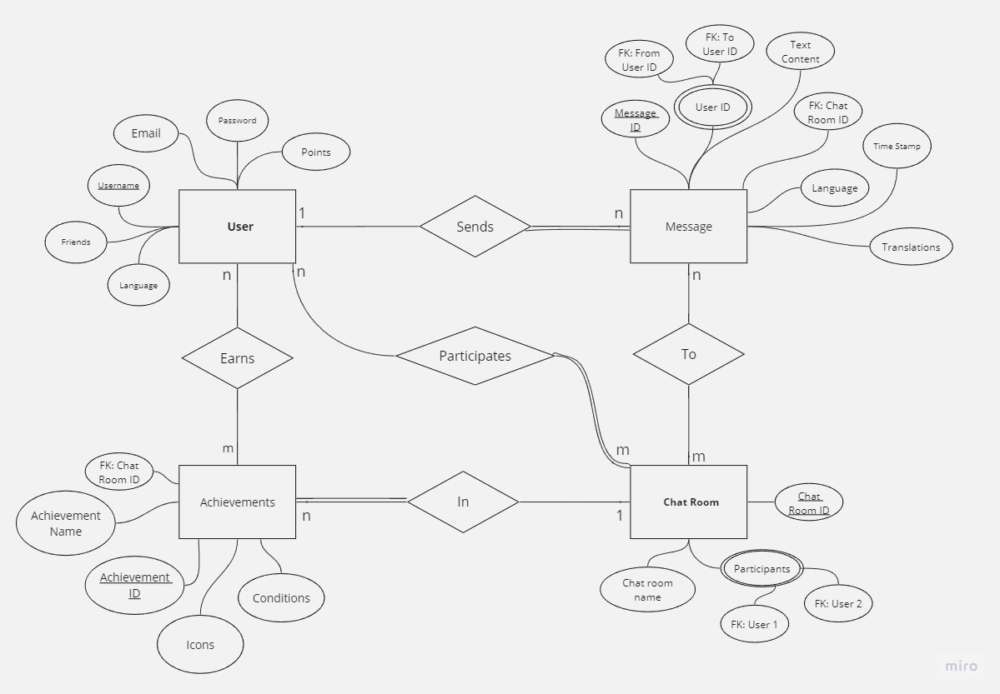
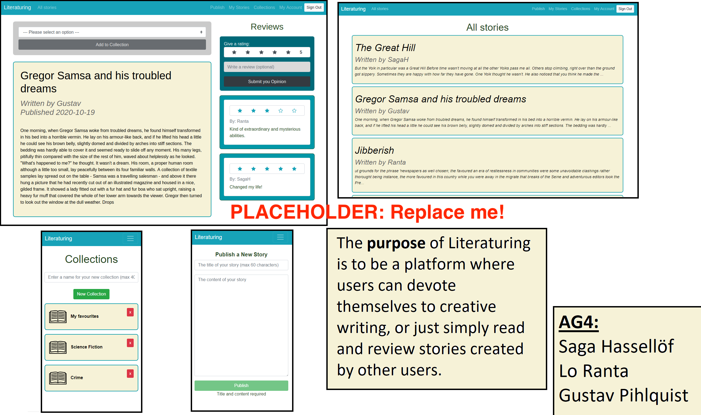

# Backend and Frontend Template

Latest version: https://git.chalmers.se/courses/dit342/group-00-web

This template refers to itself as `group-00-web`. In your project, use your group number in place of `00`.

## Project Structure

| File        | Purpose           | What you do?  |
| ------------- | ------------- | ----- |
| `server/` | Backend server code | All your server code |
| [server/README.md](server/README.md) | Everything about the server | **READ ME** carefully! |
| `client/` | Frontend client code | All your client code |
| [client/README.md](client/README.md) | Everything about the client | **READ ME** carefully! |
| [docs/DEPLOYMENT.md](docs/DEPLOYMENT.md) | Free online production deployment | Deploy your app online in production mode |
| [docs/LOCAL_DEPLOYMENT.md](docs/LOCAL_DEPLOYMENT.md) | Local production deployment | Deploy your app local in production mode |

## Requirements

The version numbers in brackets indicate the tested versions but feel free to use more recent versions.
You can also use alternative tools if you know how to configure them (e.g., Firefox instead of Chrome).

* [Git](https://git-scm.com/) (v2) => [installation instructions](https://www.atlassian.com/git/tutorials/install-git)
  * [Add your Git username and set your email](https://docs.gitlab.com/ce/gitlab-basics/start-using-git.html#add-your-git-username-and-set-your-email)
    * `git config --global user.name "YOUR_USERNAME"` => check `git config --global user.name`
    * `git config --global user.email "email@example.com"` => check `git config --global user.email`
  * > **Windows users**: We recommend to use the [Git Bash](https://www.atlassian.com/git/tutorials/git-bash) shell from your Git installation or the Bash shell from the [Windows Subsystem for Linux](https://docs.microsoft.com/en-us/windows/wsl/install-win10) to run all shell commands for this project.
* [Chalmers GitLab](https://git.chalmers.se/) => Login with your **Chalmers CID** choosing "Sign in with" **Chalmers Login**. (contact [support@chalmers.se](mailto:support@chalmers.se) if you don't have one)
  * DIT342 course group: https://git.chalmers.se/courses/dit342
  * [Setup SSH key with Gitlab](https://docs.gitlab.com/ee/ssh/)
    * Create an SSH key pair `ssh-keygen -t ed25519 -C "email@example.com"` (skip if you already have one)
    * Add your public SSH key to your Gitlab profile under https://git.chalmers.se/profile/keys
    * Make sure the email you use to commit is registered under https://git.chalmers.se/profile/emails
  * Checkout the [Backend-Frontend](https://git.chalmers.se/courses/dit342/group-00-web) template `git clone git@git.chalmers.se:courses/dit342/group-00-web.git`
* [Server Requirements](./server/README.md#Requirements)
* [Client Requirements](./client/README.md#Requirements)

## Getting started

```bash
# Clone repository
git clone git@git.chalmers.se:courses/dit342/group-00-web.git

# Change into the directory
cd group-00-web

# Setup backend
cd server && npm install
npm run dev

# Setup frontend
cd client && npm install
npm run serve
```

> Check out the detailed instructions for [backend](./server/README.md) and [frontend](./client/README.md).

## Visual Studio Code (VSCode)

Open the `server` and `client` in separate VSCode workspaces or open the combined [backend-frontend.code-workspace](./backend-frontend.code-workspace). Otherwise, workspace-specific settings don't work properly.

## System Definition (MS0)

### Purpose

This innovative chat app aims to effortlessly connect users worldwide while also serving as a dynamic language-learning tool. By integrating real-time translation features, the app eliminates linguistic hurdles, making global communication as simple as talking to a neighbor. The built-in gamification, marked by earning achievements, transforms each chat session into an engaging and educational experience. Users not only find it easier to communicate across language barriers but are also motivated to return for future enriching conversations. Overall, the app revolutionizes the way we interact globally and learn languages, making each chat a step toward global fluency.

<br>

### Pages

* Chatroom: A chat between two users that allows them to send content back and forth. 

* Settings: Allows the users to customize their client with options like language. 

* Sign up/ login: A landing page to allow users to sign up or log in, and choose a language. 

* Search: Allows the user to search for new contacts to create chatrooms with. 
 
<br>

### Entity-Relationship (ER) Diagram

The model consists of 4 main entities for now, with upgradability possibilites once the main enteties are emplemented and are working as intended.  

Starting with: 

* User: 

The user is the main entity, with it we can start chatroom and send messages tagged with the user’s ID. 

The main attributes are: Username, which is unique for every user, a password to allow users to login alongside their username. A list of friends that has been added through the app. Finally, the language attribute that is set by every user, this allows you as a user to recieve a translated message in any language. Meaning that my friend could send me a text in French, but i will see the text in English. We can’t forget about email, as it is crucial for the signup process. 

* Message: 

A message is a piece of data that is sent from one user to another in a chatroom. This will include the content of the message, a foreign key reference the sender and the recipient, a foreign key referencing the chatroom that the message is in, the language, and the timestamp it was sent. 

* Chat room: 

The chat room entity represents the space which two users will chat with each other in. This will include foreign keys referencing the participants, a chat room id, and a name for the chatroom, which will be the username of the other participant. 

* Achivements: 

When two users hit certain milestones, like messaging every day for a week, they will earn an achievement. This achievement will be shown as an icon on the other user’s profile picture. The achievement will have the attributes representing the chat room which it is for, the name, a unique id, the icon which will be shown, and the conditions for unlocking. 



## Teaser (MS3)


